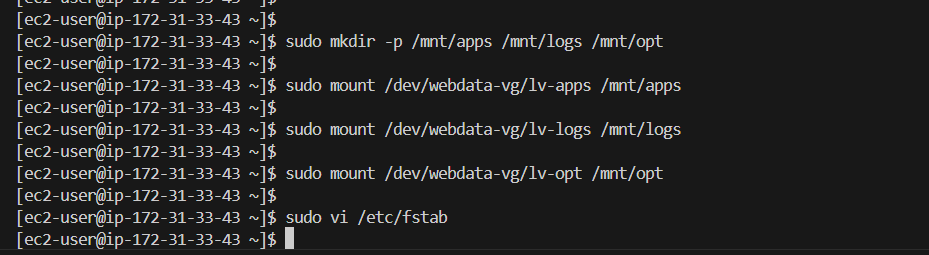
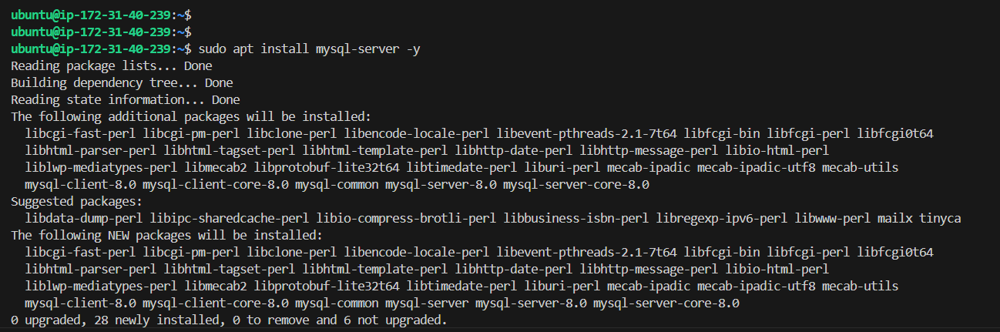
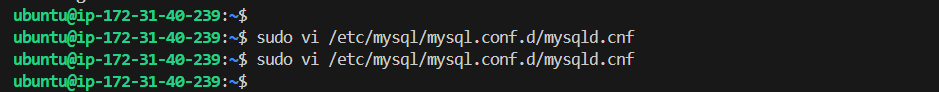

# DevOps Tooling Website Solution

In a previous project, we implemented a WordPress-based solution that can be used as a fully-fledged website or blog. Moving forward, we want to introduce a set of DevOps tools that will help your team in day-to-day activities in managing, developing, testing, deploying, and monitoring different projects.


## Setup and Technologies Used in this Project

You will implement a tooling website solution that provides easy access to DevOps tools within the corporate infrastructure. The solution will include the following components:

- **Infrastructure**: AWS
- **Webserver Linux**: Red Hat Enterprise Linux 8
- **Database Server**: Ubuntu 24.04 + MySQL
- **Storage Server**: Red Hat Enterprise Linux 8 + NFS Server
- **Programming Language**: PHP
- **Code Repository**: GitHub

---

## Architecture

In this project, you will implement a tooling website solution that makes access to DevOps tools within the corporate infrastructure easily accessible. 

The architecture consists of the following components:

1. **Infrastructure**: AWS Cloud
2. **Web Server OS**: Red Hat Enterprise Linux 8
3. **Database Server OS**: Ubuntu 24.04 + MySQL
4. **Storage Server**: Red Hat Enterprise Linux 8 + NFS Server
5. **Programming Language**: PHP
6. **Code Repository**: GitHub

The infrastructure will follow a three-tier architecture pattern with stateless Web Servers sharing a common database and using Network File System (NFS) as shared storage.

### Architecture Diagram

```
                 ┌──────────────┐
                 │  NFS Server  │
                 └──────────────┘
                       │
          ┌────────────┼────────────┐
          │            │            │
     ┌─────────┐  ┌─────────┐  ┌─────────┐
     │ Web1    │  │ Web2    │  │ Web3    │
     └─────────┘  └─────────┘  └─────────┘
          │            │            │
   ┌─────────────────────────────────────┐
   │           MySQL Database Server     │
   └─────────────────────────────────────┘
```

   

---

## Step 1 - Prepare NFS Server

### 1. Launch an EC2 Instance
- Launch a new EC2 instance with **RHEL Linux 8 Operating System**.
- Choose an instance type based on your requirements (e.g., t2.micro for testing).
- Ensure you choose an available zone for your subnet because you'll need to create EBS in the same availability zone.
   

### 2. Configure LVM
- Create and attach a new EBS volume to your EC2 instance.
   
   

- SSH into your EC2 instance and configure LVM on the server:
   
   

- Use gdisk utility to create a single partition on each of the 3 disks:

```bash
sudo gdisk /dev/xvdbb

# View attached disk
sudo fdisk -l
```
   

- Install lvm2 package: creating logical volumes, which can be resized or moved without needing to unmount file systems.

```bash
sudo yum install lvm2 -y

#Check for available partitions.
sudo lvmdiskscan 


# Create physical volume
sudo pvcreate /dev/xvdb

# Create volume group
sudo vgcreate webdata-vg /dev/xvdb1

# Create logical volumes
sudo lvcreate -L 10G -n lv-apps webdata-vg
sudo lvcreate -L 5G -n lv-logs webdata-vg
sudo lvcreate -L 5G -n lv-opt  webdata-vg

#Verify that our Logical Volume has been created successfully
sudo lvs

#Verify the entire setup #view complete setup - VG , PV, and LV
sudo vgdisplay -v
```
   
   
   
   
   
   
   


- Format the logical volumes as `xfs`:

```bash
sudo mkfs.xfs /dev/webdata-vg/lv-apps
sudo mkfs.xfs /dev/webdata-vg/lv-logs
sudo mkfs.xfs /dev/webdata-vg/lv-opt
```
   

- Create mount points:

```bash
sudo mkdir -p /mnt/apps /mnt/logs /mnt/opt
```

- Mount the logical volumes:

```bash
sudo mount /dev/webdata-vg/lv-apps /mnt/apps
sudo mount /dev/webdata-vg/lv-logs /mnt/logs
sudo mount /dev/webdata-vg/lv-opt /mnt/opt
```

- Add Mount Points to /etc/fstab and add the following lines:
```bash
sudo vi /etc/fstab

#add the following lines
/dev/webdata-vg/lv-apps /mnt/apps xfs defaults 0 0
/dev/webdata-vg/lv-logs /mnt/logs xfs defaults 0 0
/dev/webdata-vg/lv-opt /mnt/opt xfs defaults 0 0

#Verify mounts
sudo mount -a
```
   

### 3. Install NFS Server
```bash
sudo yum -y update
sudo yum install nfs-utils -y
sudo systemctl start nfs-server.service
sudo systemctl enable nfs-server.service
sudo systemctl status nfs-server.service
```
   
   
   

### 4. Configure NFS Exports
- Export the mounts for web servers' subnet CIDR to connect as clients.

```bash
# Set permissions
sudo chown -R nobody: /mnt/apps /mnt/logs /mnt/opt
sudo chmod -R 777 /mnt/apps /mnt/logs /mnt/opt

# Configure access
sudo vi /etc/exports
```

Add the following lines in `/etc/exports` (replace `<Subnet-CIDR>` with your actual CIDR, e.g., `172.31.32.0/20`):

```
/mnt/apps <Subnet-CIDR>(rw,sync,no_all_squash,no_root_squash)
/mnt/logs <Subnet-CIDR>(rw,sync,no_all_squash,no_root_squash)
/mnt/opt <Subnet-CIDR>(rw,sync,no_all_squash,no_root_squash)
```

- Save and exit the file.

```bash
sudo exportfs -arv
```
   

### 5. Open Ports for NFS
- Open TCP 111, UDP 111, and UDP 2049 in the Security Groups for NFS Server. (Note you'll only allow access from the Web Server)
   

---

## Step 2 — Configure the Database Server

### 1. Launch an EC2 Instance
- Launch a new EC2 instance with **Ubuntu 24.04 Operating System**.
   
   

### 2. Install MySQL Server
```bash
sudo apt update -y
sudo apt install mysql-server -y
```
   
   

### 3. Configure MySQL Database
- Create a new database and user.

```sql
CREATE DATABASE tooling;
CREATE USER 'webaccess'@'%' IDENTIFIED BY 'mypass';
GRANT ALL PRIVILEGES ON tooling. * TO 'webaccess'@'%' WITH GRANT OPTION;
FLUSH PRIVILEGES;
```
   

- Update the `bind-address` in the `/etc/mysql/mysql.conf.d/mysqld.cnf` file to allow remote connections:

```
bind-address = 0.0.0.0
```
   

- Restart MySQL:

```bash
sudo systemctl restart mysql
```

### 4. Open Ports for MySQL
- Open TCP 3306 in the Security Groups for MySQL Server.

---

## Step 3 — Prepare the Web Servers

### 1. Launch an EC2 Instances
- Launch 3 new EC2 instances with **RHEL 8 Operating System** and do all the following on each of the servers.
   
   

### 2. Configure NFS Client on the Web Server
```bash
sudo yum install nfs-utils nfs4-acl-tools -y
sudo mkdir /var/www
sudo mount -t nfs -o rw,nosuid <NFS-Server-Private-IP-Address>:/mnt/apps /var/www
```
   

- Verify that NFS was mounted successfully:

```bash
df -h
```
   

- To persist the mount on reboot:

```bash
sudo vi /etc/fstab
```

Add the following line:

```
<NFS-Server-Private-IP-Address>:/mnt/apps /var/www nfs defaults 0 0
```
   

   

### 3. Install Apache and PHP on the Web Server
```bash
sudo yum install httpd -y
sudo dnf install https://dl.fedoraproject.org/pub/epel/epel-release-latest-8.noarch.rpm
sudo dnf install dnf-utils http://rpms.remirepo.net/enterprise/remi-release-8.rpm
sudo dnf module reset php
sudo dnf module enable php:remi-7.4
sudo dnf install php php-opcache php-gd php-curl php-mysqlnd
sudo systemctl start php-fpm
sudo systemctl enable php-fpm
sudo setsebool -P httpd_execmem 1
```
Repeat all above steps for another 2 Web Servers.

   
   
   
   

### 4. Mount Apache Logs to NFS Server
```bash
sudo mkdir /var/log/httpd
sudo mount -t nfs -o rw,nosuid <NFS-Server-Private-IP-Address>:/mnt/logs /var/log/httpd
```

### 5. Deploy Tooling Website
- Fork the tooling source code from Steghub GitHub Account.
- Clone it to each Web Server:

```bash
sudo yum install git -y
git clone https://github.com/<your-username>/tooling.git /var/www/html
```
   
   

### 6. Update Website Configuration
- Modify the database configuration in `/var/www/html/functions.php`:

```php
$servername = "<Database-Private-IP>";
$username = "webaccess";
$password = "mypass";
$dbname = "tooling";
```
   
   

- Deploy the tooling website's code to the Webserver. Ensure that the html folder from the repository is deployed to /var/www/html
   

**Note:** If you encounter 403 Error - check permissions to your /var/www/html folder and also disable SELinux `sudo setenforce 0` To make this change permanent - open following config file `sudo vi /etc/sysconfig/selinux and set SELINUX=disabled`, then restrt httpd.
   
   

- Apply the `tooling-db.sql` script:

```bash
mysql -h <Database-Private-IP> -u webaccess -p tooling < tooling-db.sql
```
   

### 7. Open Website in Browser
- Open the website using `http://<Web-Server-Public-IP-Address>/index.php` and ensure you can log in with the credentials you created.
   
   
   
   

---
